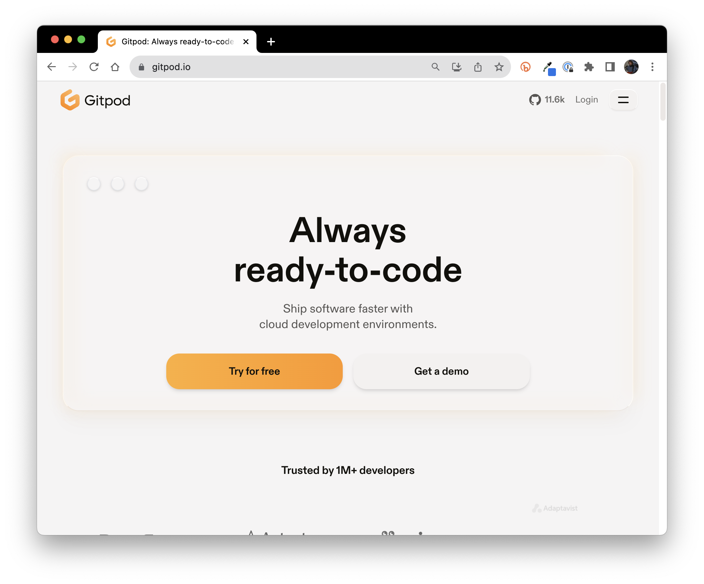

# UHM Descartes Project page

This site is build using the [Minimal Mistakes](https://mmistakes.github.io/minimal-mistakes/) Jekyll theme.

## How to edit this site

### Obtain write permission to the repo

First, you must have write access to <https://github.com/uhm-descartes/uhm-descartes.github.io>. 

A quick way to see whether you have write access is to check whether or not there is a "pencil icon" in the upper right corner of the [README.md](https://github.com/uhm-descartes/uhm-descartes.github.io/blob/master/README.md) file. If you don't see a pencil, contact Prasad or Philip with your github username and one of them will provide you with permissions.

### Set up your gitpod.io workspace

The simplest way to edit this site is by using <https://gitpod.io>:



Click the "login" link, then "Continue with GitHub", then login to GitHub. You will eventually get to the "Workspaces" page:


Click the "New workspace" button, then paste the following into the text field:

```
https://github.com/uhm-descartes/uhm-descartes.github.io
```

Select the item "github.com/uhm-descartes/uhm-descartes.github.io" that will appear, so the page looks like this:


Now press the "Continue" button to build the workspace.

You will see a VS Code Editor UI appear in the browser window, and a Terminal window pop up and begin loading libraries (in green text). Wait until the libraries are all loaded and a command prompt (in blue) appears in the Terminal window:


Now type `bundle exec jekyll serve` into the terminal window.  After a few seconds, a dialog box will pop up. You can choose "Make public":


